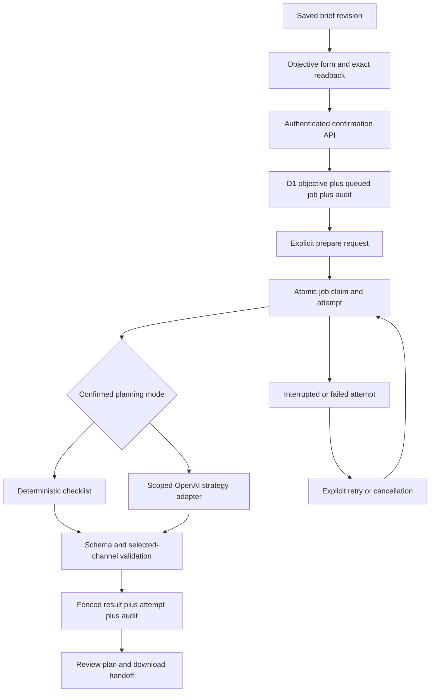

# Campaign objective and planning architecture

Implemented increment: 2026-09-07. This extends V2-01 and V2-04; voice,
specialist production and autonomous background orchestration remain incomplete.

## User result

A founder saves a brief, reviews a measurable objective and confirms it. The
workspace persists the exact inputs and a queued planning command. Preparing
the plan produces a downloadable checklist or an explicitly labelled AI
proposal with channel rationale, production intent, measurement tasks,
unknowns and the next decision. No final marketing content, account access or
external publication is established by a planning result.

The editor preserves the brief while switching workspace panels. New users
without a mission open Campaign Brief; failure of website analysis no longer
prevents access to the authenticated campaign workspace. The objective form
uses an explicit readback before confirmation, and an unknown baseline stays
unknown. Calendar dates describe the measurement window, not posting times.

An unchanged saved brief can be saved as a new revision to change a confirmed
objective or restart after cancellation. The earlier objective and job remain
immutable. Downloads include the complete saved brief as well as the objective
and result, preserving audience, channel preferences and production constraints.
Checklist generation supports the full accepted input lengths; metric and source
instructions are separate tasks so composing them cannot exceed result limits.

## Layers and boundaries

- Frontend: `campaign-planning-panel.tsx` presents persisted state, readback,
  accessible labels, request feedback, status refresh, interrupted-attempt
  recovery and exports. Shared dark workspace styles adapt to narrow screens.
- Domain contracts: `campaign-planning-pure.ts` validates metric, unit,
  baseline, target direction, calendar dates, source, guardrails and attribution
  limits. It defines result contracts and deterministic preparation steps.
- AI adapter: `campaign-planner.ts` owns provider configuration, prompt version,
  bounded request, strict output parsing and model/response/token provenance.
  Provider transport is injectable for deterministic failure evaluation.
- HTTP boundary: campaign plan routes derive the workspace and actor from
  trusted identity. JSON reads stop at 40,000 bytes. Client fields cannot
  assign ownership, lease tokens, results or provider credentials.
- Persistence: `campaign-planning.ts` owns transaction and compare-and-swap
  boundaries. Migration `0008_fine_vampiro.sql` adds objectives, jobs and
  attempts with indexes and cascading ownership.

## AI contract and evaluation

AI mode uses the existing Responses API credential and configured model, with
an additional exact workspace allowlist and explicit operator opt-in. It has
no tools, no web research and no account credentials in the prompt. The brief
and objective are data in a separate input; instructions prohibit final copy,
invented evidence and claims of execution. Output is an unverified strategic
proposal. Prompt instructions are not a guarantee of factual or semantic
correctness, so human review remains necessary.

The request uses JSON Schema Structured Outputs and application validation;
refusals, incomplete responses, malformed output and unselected/duplicate
channels are rejected. This follows the [official Structured Outputs
guide](https://developers.openai.com/api/docs/guides/structured-outputs).
Provider storage is disabled. The adapter records model, prompt version,
response ID and reported token usage, without claiming these are actual
currency costs. No ML training pipeline or predictive scoring is introduced.

Checklist mode is deterministic preparation, not simulation of AI or market
performance. An AI failure never silently switches to checklist mode.

Regression evaluation covers malformed/refused/incomplete responses, hostile
brief instructions, exact input forwarding, lack of tools, channel constraints,
provider failure redaction and absence of automatic retry. These are contract
tests using mocked responses. Live model quality, factual grounding, provider
access and pilot usability remain unmeasured.

## Durable execution and recovery

Each brief revision can have one immutable objective and one planning job.
Confirmation retries with identical input return the existing job; conflicting
objectives require a new saved brief revision. Confirmation, job creation and
audit commit together. The actor is retained as the objective owner.

Jobs follow `queued → running → completed | failed`. Failed or expired running
attempts can be retried explicitly; queued, failed or expired work can be
cancelled. Active provider requests cannot be labelled cancelled. Claims use
the reviewed attempt number, a new token and a two-minute lease. Both old
tokens and expired leases are barred from completion. Attempt lineage retains
interrupted runs instead of replacing them.

Limits are enforced at the atomic claim boundary: three attempts per job and
ten attempts per workspace over a rolling 24 hours, including checklist runs.
AI requests have a 60-second timeout and 4,000 maximum output tokens; the UI
request timeout is 75 seconds. These are operational limits, not monetary
budget reservations. Reconfiguration is required to enable shared-key AI use.

Execution is request-driven. The records survive browser closure or process
restart; guaranteed continuation outside a request is not implemented. A
response lost before persistence can mean provider usage with no saved plan.
Recovery is explicit and warns that a retry can incur additional usage. There
is no automatic takeover, external idempotency promise or provider result
lookup while provider storage is disabled.

Objective, job and attempt records participate in workspace export/deletion.
Late completions after deletion cannot recreate deleted work. The result and
completion audit are transactional; if persistence fails, the job stays
unresolved rather than falsely recording provider failure.

## Next implementation dependencies

1. Qualify pilot production providers and supported account capabilities.
2. Add a hosting-supported background consumer and restart/reconciliation
   evidence before promising autonomous continuation.
3. Add separate monetary reservations and scoped production authorization.
4. Build voice-to-reviewed-objective commands with correction and negation
   evaluation against the same deterministic confirmation boundary.
5. Evaluate AI plan usefulness with real briefs before expanding autonomy.
