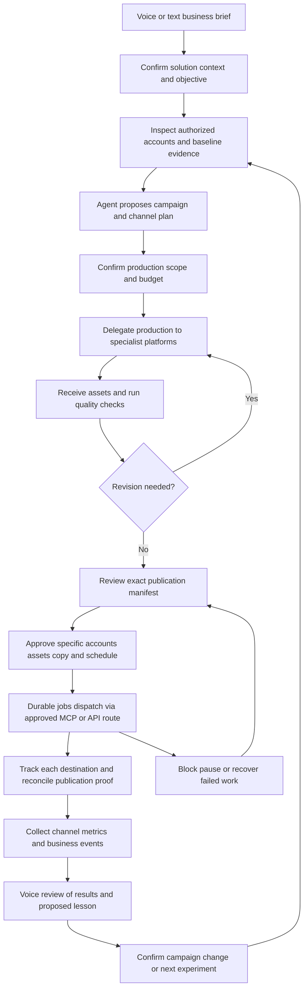
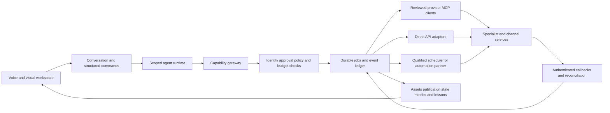

# Distribution OS: agentic, voice-first marketing and distribution

Decision date: 2026-09-07. Status: target product and delivery plan, not a claim of implemented capabilities.

This direction incorporates the owner's clarification and supersedes the earlier email-first delivery ordering and any proposal to build content generation inside Distribution OS. [Current State](CURRENT_STATE.md) remains authoritative for working software. [Integration Feasibility](INTEGRATION_FEASIBILITY.md) defines the 31-tool target portfolio and its access constraints. [Outcome Delivery](OUTCOME_DELIVERY.md) remains the engineering method.

## 1. Product definition

**Distribution OS is a voice-first, agentic platform that manages the marketing, content operations and distribution of a solution across connected specialist tools and channels.**

The user describes a business goal. Distribution OS builds and maintains solution context, plans campaigns, commissions creative work, coordinates reviews, arranges distribution, monitors outcomes and proposes the next decision. Specialized platforms produce the actual videos, images, designs, scripts, captions, posts, articles and audio. Users retain control of their accounts, brand, budgets and public commitments.

The product must support continuing operations: positioning, launches, evergreen education, community participation, acquisition, product adoption, lifecycle communication, retention and reactivation. First payment is one early-stage outcome. Established solutions need qualified pipeline, adoption, retention or efficient growth; awareness and education need appropriate intermediate evidence and longer evaluation windows.

Primary users are solution founders and small marketing teams. Each workspace can manage a brand and its solutions, offers, audiences and campaigns. Agency portfolios follow after client isolation and approval ownership are proven. A consumer product, developer tool and B2B service should not receive the same channel mix or success metric.

## 2. Responsibility boundary

| Distribution OS owns | Connected specialists own | Human owner retains |
| --- | --- | --- |
| Solution understanding, objectives, positioning hypotheses, market evidence | Production of publishable text, captions, scripts, articles and translations | Truth of product claims and final brand decisions |
| Campaign strategy, editorial intent, channel selection, calendar and dependencies | Images, photos, illustrations, thumbnails, layouts and design files | Rights to logos, people, voices, footage, music and source material |
| Production briefs, provider selection, spend reservations, handoffs and revisions | Video rendering, editing, repurposing, dubbing, subtitles and audio production | Provider accounts, account authorization and budget limits |
| Asset references, versions, review comments, quality checks and approval manifests | Native creative editors and production-model infrastructure | Exact public-action approval and high-impact campaign changes |
| Scheduling coordination, tool execution, receipts, retries and cancellation | Channel hosting, moderation and the final publication system | Community participation rules and sensitive conversations |
| Measurement definitions, business-event correlation, reports and lessons | Source analytics, CRM, email and payment records | Accepting uncertain attribution and deciding what to scale |

Distribution OS may summarize evidence, write strategic briefs and specify creative intent. It does not silently use its planning model to generate final marketing copy when a specialist is unavailable. The fallback is another explicitly authorized specialist or a human production task. Previews and small corrections can be reviewed in the OS; a full design/video/text-generation studio is out of scope. Semantic rewrites, translations and new creative variants are new production requests.

Existing generated hooks, content drafts and simulated material remain identifiable historical artifacts. They are not relabelled as externally produced. New production follows the delegated contract.

## 3. Operating principles

1. **Voice leads the interaction.** Speak to brief, ask, compare, revise, approve a named reviewed set, pause and learn. A synchronized visual workspace preserves exactness and makes media review practical. Every essential operation also works with text and keyboard.
2. **Agents carry work forward.** They decompose goals, select eligible tools, delegate, inspect results and recover from failures. They can ask for missing decisions without requiring the user to manually trigger every stage.
3. **The workflow is durable.** A conversation can end while production, review or measurement continues. A model context window is not the job queue or source of truth.
4. **Coordinate specialists.** Own context and operational accountability; buy creative production, channel access and specialist capabilities through supported interfaces.
5. **Support breadth with honest capability labels.** Twenty-plus integrations are a platform objective. Each campaign activates a purposeful subset. Publishing, reading metrics, replying and advertising are different capabilities even on the same account.
6. **Adapt to each channel.** Reuse the underlying idea and approved evidence; commission the right format, tone, CTA and participation model for the destination.
7. **Separate evidence levels.** Submitted, accepted, processing, published, viewed, clicked, qualified, converted and paid have distinct meanings. A verified source does not establish causal impact.
8. **Earn autonomy.** Start with self-directed research and coordination plus exact publication approvals. Broader delegated policies require explicit scope, operating evidence and an owner decision.
9. **Optimize for useful decisions and sustainable operations.** Content volume, integration count and agent activity do not establish marketing success.

## 4. User experience and voice contract

The home screen is a conversation and campaign command center: active solution, current objective, today's decisions, production/publication states, budget remaining and result freshness. The primary affordance is “Talk to your marketing lead.” It opens a deliberate microphone session with visible recording status and live transcript. The agent gives a brief answer, offers the next useful decision and brings the relevant evidence or media into view.

| Spoken intent | Durable result | Ambiguity handling |
| --- | --- | --- |
| “Help market our new team-plan feature.” | Proposed campaign linked to solution, audience, offer and objective | Ask what the release does, whom it helps and which result matters if those facts are missing |
| “Plan two weeks for LinkedIn and YouTube; spend at most $200 producing assets.” | Campaign brief and separate production budget, with currency and dates | Read back account names, currency, timezone and absolute dates; do not assume this authorizes ad spend |
| “Ask our video provider for a product walkthrough.” | Versioned production request with deliverables and cost ceiling | Resolve provider, source footage, format and deadline before submission |
| “The second version sounds too formal.” | Revision request tied to the visible asset and version | Resolve what “second” refers to; no unrelated asset changes |
| “Approve launch set 7, revision 3.” | Exact approval manifest bound to an authenticated approver | Require the reviewed account, copy, media versions and schedules; if unclear, show and read back the set |
| “Pause everything for this solution.” | Persisted pause on new dispatches plus cancellation requests for eligible jobs | Report what is stopped, still rendering, already submitted and already published |
| “What changed this week, and what should we do?” | Evidence-linked spoken summary and written decision options | State delayed metrics and insufficient samples; separate diagnosis from a proposed explanation |

Voice session states: `idle → listening → interpreting → responding`, with explicit `needs_clarification`, `awaiting_review`, `disconnected` and `ended`. Durable commands separately track `draft → confirmed → queued → running → completed|blocked|failed|cancelled`.

Build a browser realtime voice experience using a voice-provider abstraction. OpenAI documents both live speech-to-speech and chained transcription/reasoning/speech architectures; its WebRTC path allows a backend to mint a short-lived client credential while retaining the permanent key on the server. Use realtime conversation for briefing and interruption, with a server-owned structured command boundary for mutations. Model and vendor selection are evaluated during implementation rather than hard-coded into the vision. [Voice architectures](https://developers.openai.com/api/docs/guides/voice-agents), [WebRTC session setup](https://developers.openai.com/api/docs/guides/realtime-webrtc).

Design requirements: interruption stops speech immediately but does not falsely claim a submitted job was cancelled; reconnect restores the campaign's actual state; duplicate transcriptions cannot duplicate actions; negation, accents, names, dates and amounts receive explicit evaluation. Ordinary speech recognition confidence is not authorization. No always-listening mode by default. Keep only needed transcripts/command evidence under a workspace retention policy; raw audio retention is opt-in. Platform-mandated posting screens still apply, including when the request began by voice.

## 5. Agent organization

Start with a small set of role configurations sharing one runtime. They do not need separate models, deployments or continuously running processes.

| Agent role | Work and tools | Required output / limit |
| --- | --- | --- |
| Marketing lead / orchestrator | Clarifies voice intent, maintains campaign plan, assigns and monitors work | Versioned objective, task dependencies, decisions needed; cannot mint approvals |
| Research and positioning | Reads authorized product, market and audience evidence | Cited findings, hypotheses and unknowns; no arbitrary scraping or publishing |
| Channel strategist | Evaluates audience fit, account history, format, cost and available capabilities | Channel plan with rationale, cadence and measurement window; can abstain |
| Creative producer | Commissions specialists, coordinates versions and reviews | Production briefs and deliverable manifests; does not render assets or author final marketing content internally |
| Distribution operator | Preflights approved manifests, schedules, reconciles receipts and pauses | Per-destination state and proof; no unreviewed payload substitution |
| Community and lifecycle coordinator | Triages permitted replies/comments and routes follow-up | Prioritized human tasks or specialist-produced reply drafts; no automatic engagement spam |
| Analyst and experiment lead | Reads source metrics, evaluates objectives, proposes lessons | Source-linked report with uncertainty, attribution limitations and next experiment |

Identity, permissions, spending, credential access, approval matching and idempotency belong to deterministic services outside the agents. Each run records input versions, available capabilities, decisions, output references, tool attempts, cost, elapsed time and a bounded rationale. Limit tool calls, delegation depth, runtime and revision rounds. Failed work returns a concrete blocker and owner. Agents receive only the tools relevant to their role, campaign and tenant.

## 6. Complete campaign workflow

### A. Understand the solution and establish a baseline

Accept the website and a voice briefing, then collect the minimum missing context: product truth, audience, promise, alternatives, pricing, brand guidelines, proof, geographies/languages, budget, current channels, existing material and prohibited claims. Import authorized source documents and previous performance. Keep fact, owner confirmation and inference separate. Confirm major contradictions before commissioning material.

The output is a versioned solution profile, account inventory and objective contract. Example: qualified demo requests from a defined audience over a 28-day window, with a baseline, target, attribution window, spending limits and a guardrail against poor-quality leads. “Increase awareness” is valid when its measurable proxy and limitations are explicit. A missing baseline creates a measurement task, not an invented uplift estimate.

### B. Build a campaign and a channel-specific plan

The strategist proposes an audience, message hypothesis, offer, content pillars, distribution tactics and evidence needed. Evaluate channels by audience accessibility, intent, existing traction, format fit, production effort, community norms, available access, measurement quality and spend. Show assumptions and allow override with a reason.

For a B2B product, the initial hypothesis might combine LinkedIn education, a YouTube walkthrough and an owned landing page. For a visually demonstrable consumer solution, TikTok/Instagram may be more plausible. Reddit requires community-specific participation and access review; it is not a mirrored corporate feed. These are hypotheses to test, not universal channel recommendations.

Create a calendar with dependencies, per-channel assets, CTA, owner, draft/review deadlines, publication time in the user's timezone, UTC execution time and metric collection windows. Plan organic publishing, lifecycle communication and paid distribution separately. Ad account writes and autonomous budget increases are later capabilities with distinct approval.

### C. Commission production externally

The creative producer turns editorial intent into a structured brief. It selects eligible providers using deliverable type, brand support, available credentials, price ceiling, expected turnaround and rights requirements. Use one text specialist plus one visual/video specialist in the first pilot; a workflow may later coordinate several.

Send only necessary context: approved claim references, brand/style identifiers, audience, desired message, deliverable specifications, CTA, source assets, language, accessibility requirements, disclosures, due date and permitted revision budget. Reserve cost before submission. Store the external project/job ID and the source brief version.

The specialist creates the actual post, script, image, video or audio. Distribution OS receives a result through authenticated callbacks or bounded polling. It records external project links, immutable asset checksums, output type, dimensions/duration, captions/transcript, version, provenance, rights declarations, delivery expiry and reported cost. Long rendering jobs survive browser closure. Requests that fail definitively may be retried under policy; ambiguous billed jobs must be reconciled before a replacement provider is commissioned.

Quality checks cover objective/brief match, format, evidence-backed claims, branding, duplicate content, working CTA, subtitles/alt text, source rights and channel disclosures. Automated review flags issues; it does not certify legal rights or perfect brand quality. Revision comments go back to the specialist. Freeze the accepted export before approval so a changed provider URL cannot replace approved bytes.

### D. Review and approve distribution

Present one campaign review set with per-channel previews, exact destination identities, final text and asset versions, schedule, audience/privacy settings, spend and provider-specific declarations. The user may approve a named set in one interaction, exclude items or request revisions. The backend records item-level approval hashes within the set. Any material change invalidates the affected item; untouched items retain their valid approval.

Approval to pay for production is separate from permission to publish, reply or buy ads. Account authorization is separate from both. Mandatory native UX cannot be replaced by a generic voice “yes.” TikTok's documented publishing flow, audit restrictions and intended-use rules must be assessed explicitly; an internal account-upload utility is not automatically eligible. [TikTok publishing guidelines](https://developers.tiktok.com/docs/en/content-sharing-guidelines).

### E. Schedule, distribute and handle partial completion

Choose one writer per account/capability: a qualified aggregator or a direct adapter. Never schedule the same item through both. Native scheduling is used only when tested; otherwise a durable OS job submits at the correct time. Before dispatch, recheck account identity, scopes, health, approval hash/expiry, media availability, budget and schedule validity.

Use separate states for OS scheduling, provider acceptance, processing and confirmed publication. An aggregator queue ID is not a social post URL. Store both intermediary and channel identifiers when available; label aggregator-only evidence accurately. Poll or consume webhooks until the provider's terminal result is known. A network timeout is `unknown`, not an invitation to send again.

If LinkedIn publishes while YouTube processing fails, show partial completion and repair only YouTube. If a token expires, retain the work and request reconnection to the same account. Pausing stops new dispatches immediately; cancellation of accepted provider work is best effort and reported honestly. Already published content requires a separate takedown decision; there is no universal rollback of a campaign.

### F. Operate community and lifecycle work

Where authorized, ingest replies, comments and opted-in leads; classify questions, objections, support issues and commercial intent. Route sensitive or ambiguous threads to a person. Delegate proposed response copy to the text specialist with minimal thread context; review before sending. Respect suppression/unsubscribe state and per-channel participation rules. Do not include automatic likes, follows, fabricated personas, blanket DMs or indiscriminate cross-posting as growth mechanisms.

### G. Measure and improve

Collect platform metrics with their original definitions, date ranges, retrieval timestamps, missing-data flags and account scope. Track links and site/product events where users have configured them. Connect leads and commercial events through explicit identifiers where possible. Do not add platform reach counts together and call them unique people. No universal attribution claim across devices, closed platforms, dark social or untracked offline activity.

Give a concise daily voice brief for exceptions and decisions, a weekly campaign review, and a deeper objective review at the configured window. Long-form video and SEO can require longer windows than launch email. Describe outcomes at the right level: publication reliability, qualified attention, conversion or retained use. Separate source-verified measurements, modeled attribution and causal experiments.

The analyst proposes continue/change/stop decisions with evidence, uncertainty, expected cost and a disconfirming signal. A lesson becomes reusable memory only when approved or admitted under an explicit low-risk policy. Material changes to offer, positioning, audience or spend require review. A loop that has insufficient data should wait or improve instrumentation rather than produce a confident new strategy.

## 7. MCP and API architecture

MCP is a tool interface, not a substitute for platform access, commercial approval, scopes or a durable executor. Use official provider MCP where its tool contract fits. Otherwise implement a narrow typed wrapper over the provider's documented API; expose approved OS capabilities to the agent rather than arbitrary HTTP or an unrestricted third-party tool list.

Provider-side tokens remain tenant/account-bound in a vault. Incoming MCP identity and upstream provider authorization are distinct credentials; validate audiences and never pass an incoming MCP token through to an unrelated API. Pin supported protocol versions and review current security guidance during implementation. [MCP authorization](https://modelcontextprotocol.io/specification/2025-11-25/basic/authorization).

Capability examples: `campaign.propose`, `production.quote`, `production.submit`, `production.status`, `asset.inspect`, `publication.prepare`, `publication.submit_approved`, `publication.status`, `metrics.read`, `campaign.pause`. A model cannot invoke `submit_approved` successfully without the persisted manifest and server checks. Native MCP tool discovery must be filtered, schema-validated and reviewed; tool descriptions and returned website/social content are untrusted input.

Capability manifest: provider and route; account type; supported read/write operations; scopes; access-review state; tool/API versions; media and scheduling limits; webhook/polling support; idempotency/reconciliation method; health and freshness; cost units; retention/region restrictions; human UX requirements; evidence strength; owner; last contract-test date; kill switch. A connected provider may expose one healthy read capability and a blocked publishing capability.

## 8. Durable contracts and data model

Extend the current TypeScript/Workers/D1 architecture incrementally. Run queue consumers and scheduled reconciliation outside request lifetimes. Select a durable job implementation after a restart/race/retry spike in the existing hosting environment; evaluate Workers-compatible queues/workflows before introducing a second backend. No schema or hosting capability is assumed available merely because it appears in this plan. Long creative processing happens at the specialist provider.

| Record | Essential fields and purpose |
| --- | --- |
| Solution profile | Tenant/solution, approved claims, audience, offers, brand sources, exclusions, versions |
| Objective | Metric definition, baseline/target, source, owner, window, attribution limits and guardrails |
| Campaign | Objective, strategy version, channels, calendar, budget buckets, status, dependencies |
| Voice command | Actor/session, normalized intent, resolved references, readback/confirmation, idempotency ID; limited transcript |
| Connector account/capability | Provider account ID, credential reference, route, scopes, access state, health, quotas |
| Production brief/job | Brief version, specialist, input references, reserved/actual cost, job ID, deadline and revision lineage |
| Asset version | Provider project, immutable export/hash, metadata, provenance/rights declaration, QA and review |
| Approval manifest/item | Actor, campaign/version, exact account/copy/media/schedule/spend hash, expiry and exclusions |
| Publication/attempt | Route, external request/post IDs, per-attempt status, receipt, unknown-result reconciliation |
| Metric observation | Source definition, scope, period, observed/retrieved time, attribution IDs and data quality |
| Lesson | Evidence and decision references, confidence limitations, acceptance state, affected future plans |

Asset binaries may be retained in authorized object storage when needed for stable publication; retain creative source projects in specialist tools. Asset ownership/licensing remains explicit. Credentials never appear in briefs, model prompts, transcripts or portable manifests.

Campaign state: `draft → planned → producing → in_review → scheduled → active → measuring → completed`, with `paused`, `blocked`, `cancelled` and `partially_completed` branches. Jobs independently track execution and retry state. State changes depend on records and events, not narration.

Transactional boundaries cover approval plus audit, budget reservation plus job creation, and job claims. Replays must not duplicate bills or posts. Where a provider lacks idempotency or lookup, allow at-most-one submission attempt followed by manual reconciliation for uncertainty; do not promise exactly-once external execution.

## 9. Integration strategy

The target portfolio contains **31 named tools**, including the six requested social channels, production specialists, publishing intermediaries, owned channels, analytics and business systems. This is a qualification portfolio, not 31 existing integrations or a requirement that every customer subscribe to all of them. Full details and sources are in [Integration Feasibility](INTEGRATION_FEASIBILITY.md).

Begin with a supported publishing intermediary where it can supply correct account binding, per-channel state and publication evidence, while pursuing native provider approvals early. Add direct adapters for valuable gaps. The intermediary does not waive provider rules or guarantee every post type, comment, inbox or analytics endpoint. Distinguish **tools integrated**, **destinations qualified**, and **capabilities verified** in roadmap reporting.

The six core channel targets are TikTok, YouTube, Instagram, LinkedIn, X and Reddit. If one is blocked by provider access, preserve a truthful human handoff and keep it out of the automated-support count. The architecture must support the broader product without disguising unapproved access as autonomous execution.

## 10. Result-oriented delivery backlog

These V2 stories take priority over conflicting implementation tasks in the historical 84-story catalog. Existing approval, receipt and tenant-hardening work is reused. A completed technical task is not a completed user story without its observable result.

| ID / phase | User story | Acceptance evidence |
| --- | --- | --- |
| V2-01 / F1 | As a founder, I can brief the marketing lead by voice and correct its understanding | Persisted profile and objective; transcript correction, negation/date/amount tests and text fallback |
| V2-02 / F1 | As an operator, I can see exactly what each connected account can do | Real identity/scope/health probe, visible access blockers, reconnect to the same account |
| V2-03 / F1 | As an owner, I can authorize production cost without authorizing publication | Separate budget and publication permissions; cost reservation survives concurrent submissions |
| V2-04 / F2 | As a marketer, I receive a campaign suited to my audience and available channels | Objective, rationale, calendar, CTA, measurement plan and unknowns; unavailable writes excluded |
| V2-05 / F2 | As a marketer, I can commission a specialist to produce final text and visual/video material | External job IDs, real returned text/media, cost and provenance; no internal generation fallback |
| V2-06 / F2 | As a reviewer, I can request revisions by voice without losing versions | Correct asset reference, version diff, specialist revision receipt, invalidated affected approvals |
| V2-07 / F2 | As an owner, I can approve an exact campaign set in one review | Per-item hashes and exclusions; changed media/copy/account/schedule requires new approval |
| V2-08 / F2 | As an operator, I can publish to two suitable channels and know what actually went live | Destination IDs/URLs or clearly limited intermediary evidence; one writer per item |
| V2-09 / F2 | As an operator, I can close the browser and resume production or publishing safely | Restart, expired-token, duplicate-callback and unknown-timeout scenarios; no duplicate dispatch |
| V2-10 / F2 | As an owner, I can pause a campaign by voice | New dispatches stop; accepted and already published work reported separately |
| V2-11 / F3 | As a manager, I can operate the six core social destinations with explicit capability limits | A capability-specific proof for each available account; blocked providers remain blocked |
| V2-12 / F3 | As a marketer, I can manage an editorial calendar across campaigns | Conflict detection, asset dependency dates, timezone/DST behavior and missed-slot recovery |
| V2-13 / F3 | As a founder, I can review channel and business results in a spoken weekly briefing | Source-linked observations, delayed/missing data labels, no invented reach or causal lift |
| V2-14 / F3 | As a community operator, I can respond to important permitted conversations | Correct thread, human escalation, specialist-produced draft and separate send approval |
| V2-15 / F4 | As a growth lead, I can connect the wider existing stack | More than 20 tool integrations qualified against their declared capabilities and support ownership |
| V2-16 / F4 | As a marketer, I can replace a production provider without losing campaign context | Portable brief, explicit new cost, retained versions; uncertain old jobs reconciled first |
| V2-17 / F4 | As an owner, I can adopt a lesson that improves the next campaign | Evidence-linked proposed change, recorded acceptance and traceable subsequent use |
| V2-18 / F4 | As an agency, I can manage client campaigns without crossing brands or accounts | Role-aware client switching, adversarial tenant tests and client-specific approvals |

## 11. Phased plan and realistic staffing

Planning estimate, not a delivery guarantee: a team of 4–6 engineers covering product/voice, integrations, backend reliability and QA/automation, plus a product/design lead and a marketing operator for pilots. Security/operations review and provider onboarding need explicit ownership. Provider reviews, enterprise subscriptions and data permissions can determine calendar time independently of engineering.

| Phase | Indicative duration | Outcome and exit gate |
| --- | --- | --- |
| F0: qualify the route | 2 weeks | Select pilot segment and two primary channels; verify intermediary and text/visual specialist access; start native provider applications; agree budgets and quality rubric |
| F1: voice and control foundation | 3–5 weeks | Voice brief creates a durable objective; scoped connector gateway, vault, budget reservations, job recovery and approval ownership demonstrated |
| F2: complete campaign pilot | 4–6 weeks | External text plus image/video production, review/revision, approved publication to two suitable channels, pause/recovery and result collection with real test accounts |
| F3: core social operations | 6–10 weeks | Expand toward the six named social channels, community triage, campaign calendar, business-event measurement and weekly voice decisions; qualify each separately |
| F4: wider platform | 6–10 weeks | Qualify 20+ tool integrations from the portfolio, specialist portability, accepted lessons, client controls and support runbooks |

Sequentially this is approximately 21–33 weeks, or about 5–8 months, with substantial access and procurement uncertainty. Parallel work can reduce the critical path only where dependencies and staffing allow. A solo implementation should prioritize the F2 workflow and re-estimate later phases from observed throughput. Do not market six-channel automation or 20+ working integrations before the respective gates pass.

The first two-week implementation increment after access qualification is: voice briefing and text fallback; durable command-to-objective persistence; account/capability probing; one externally produced text asset and one visual/video job with status and review. Publication preparation can be demonstrated, but paid rendering or public posting still uses configured accounts and authorized budgets. Resend receipt recovery remains useful infrastructure evidence, not the product's defining user journey.

## 12. Economics, validation and operating discipline

Track separate costs for voice, reasoning, creative generation/revisions, API usage, storage/egress, scheduler subscriptions and paid media. Record estimated, reserved, consumed and reconciled amounts; a completed API request can still return an unusable asset. Set per-job and per-campaign ceilings, bounded revision counts, short voice-session limits and budget alerts. State whether customers bring their own accounts or costs are rebilled; do not hide enterprise specialist subscriptions inside an assumed cheap flat fee.

Evaluate product quality with real pilot tasks: completing a voice brief, understanding the next decision, commissioning a usable asset, correcting the right version, approving the correct accounts, recovering a failure and interpreting results. Proposed initial gates: at least 4 of 5 pilot operators complete the principal workflow with no account confusion; all supported writes pass approval/tenant tests; injected retries and restarts do not duplicate submissions in the supported contract; every displayed success has the declared evidence source. These are acceptance targets, not measured achievements.

Measure ongoing business usefulness through operator time saved, approved-asset turnaround, revision cost, publication reliability, qualified response, objective conversion and retained weekly use. Benchmarks for reach or revenue come from the campaign baseline and window, not a universal platform promise. Evaluate voice latency and task completion on actual devices, networks, languages and accents before committing to an SLO.

Maintain per-connector contract tests, sandbox smoke tests, API-version monitoring, quota alerts, circuit breakers, support owner and reconnect/reconciliation runbooks. Test prompt injection in social content and MCP descriptions, malicious media URLs, cross-tenant references, stale approvals, duplicate webhooks, provider outages, partial campaigns, broken analytics and cancellation races. Respect providers' access terms and licensed use; an unavailable API becomes a product limitation with an explicit handoff.

## 13. Repository implementation sequence

1. Preserve existing tenant checks, exact action decisions, execution claims/receipts, event ledgers and truthful simulation labels.
2. Replace the universal first-payment-only objective with a versioned objective model; retain payments as one verified outcome. Expand Mission Control from stage advice to campaign decisions and spoken operation.
3. Consolidate connector catalog/setup concepts into capability manifests plus tenant account installations. A catalog row never grants an agent a tool.
4. Add voice sessions and durable commands; keep providers and workflow state behind server APIs. Introduce campaign, production-job, asset-version and approval-set records with forward migrations.
5. Refactor current content generation paths into strategic briefs and external production adapters. Keep old artifact provenance and mark simulation explicitly; do not delete records or silently change historical authorship.
6. Add one specialist text adapter, one visual/video adapter and one qualified publishing route. Reuse the current execution protections with provider-specific reconciliation.
7. Add per-campaign and per-experiment metric windows and business-event lineage; existing mission-wide counts are insufficient for new campaign decisions.
8. Split workspace screens around conversation, campaigns/calendar, production/review, distribution/inbox, results, connections and governance. Move internal run details behind decisions and evidence.
9. Expand through conformance-tested adapters and rollout flags. Do not rebuild the entire stack, a creative editor, a CRM or an unrestricted automation engine to achieve the first campaign workflow.

This plan changes the target and backlog. Voice, delegated production and the expanded connector platform remain to be implemented and proven with provider accounts.
